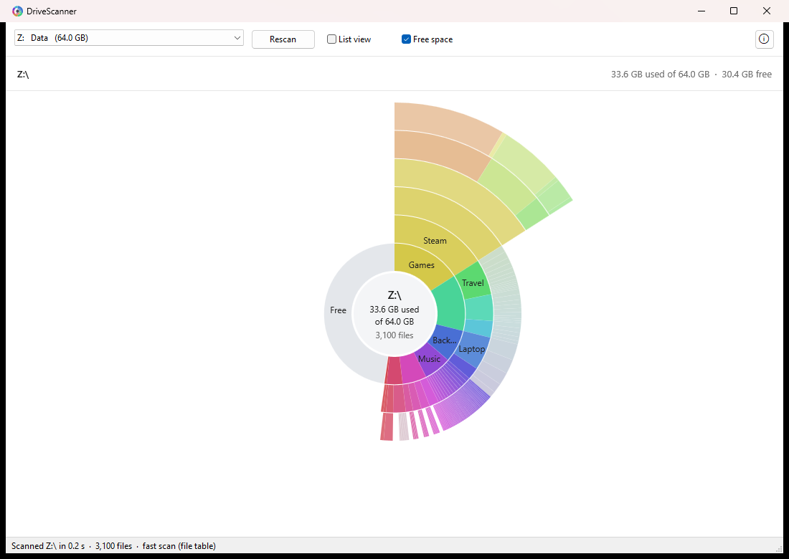

# DriveScanner

A small, portable disk usage viewer for Windows.



DriveScanner scans a drive and shows how its space is used, either as concentric rings (one ring per folder level) or as a size-sorted tree list. It is a single self-contained executable of about 115 KB, with no installer, no dependencies, and no settings written to disk.

## Features

- Rings and list views of any local, removable, or network drive
- Free space shown to scale against used space at the drive level
- Drill-down navigation with breadcrumb
- Open in Explorer and copy path for any file or folder
- Per-monitor high-DPI support

## Scanning

| Mode | Used when | Notes |
|---|---|---|
| File table | Running as administrator on an NTFS volume | Reads the NTFS Master File Table directly. Fastest, and includes folders a standard user cannot open. |
| Directory | All other cases | Parallel directory enumeration. Inaccessible folders are skipped and reported. |

Sizes are reported as size on disk (allocated space). Cloud-only placeholder files count as zero, and hard-linked files are counted once.

## Building

Requires [Zig](https://ziglang.org/download/) 0.16 or later on `PATH`.

```powershell
.\build.ps1
```

## License

MIT. See [LICENSE](LICENSE).
